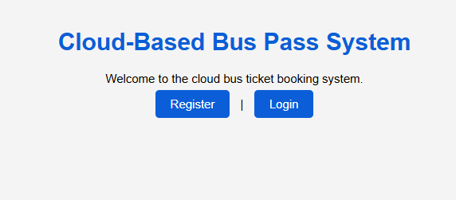
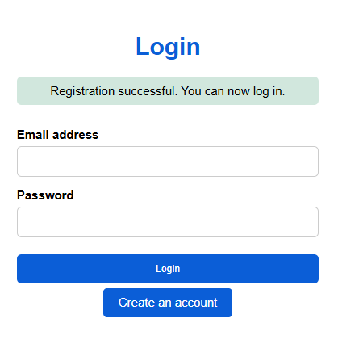
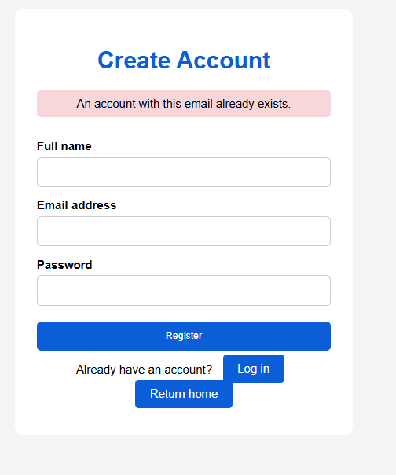
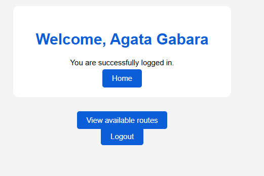
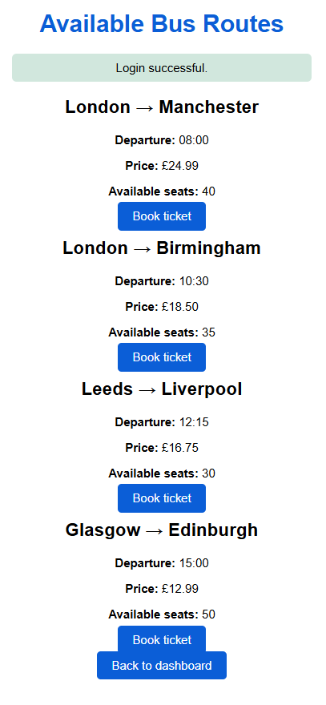
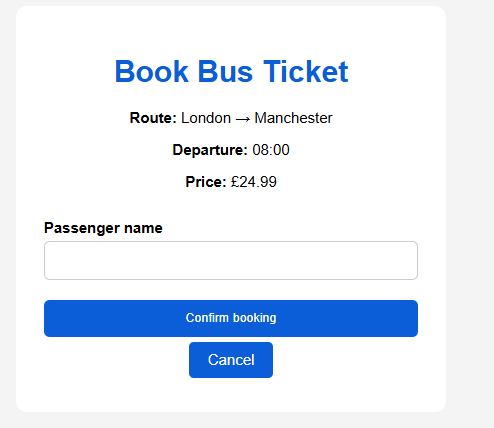
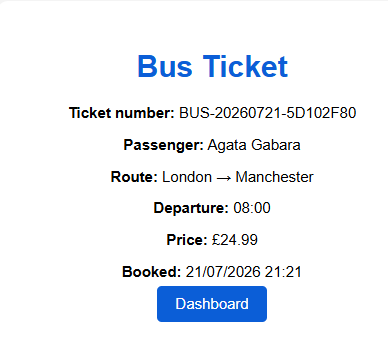
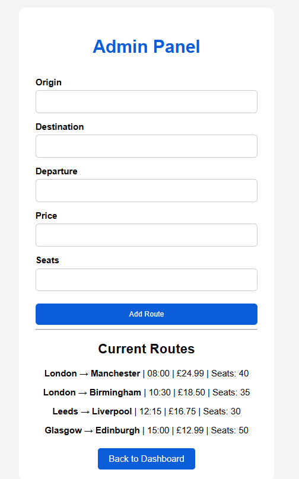

# Cloud-Based Bus Pass System

## Description

Cloud-Based Bus Pass System is a web application developed using Python, Flask and SQLite.

The application allows users to:

- Register a new account
- Log in securely
- View available bus routes
- Book bus tickets
- Generate unique ticket numbers
- View booking history
- Cancel bookings

The system also includes an administrator panel for managing bus routes.

---

## Technologies Used

- Python 3
- Flask
- Flask-SQLAlchemy
- Flask-Bcrypt
- SQLite
- HTML5
- CSS3

---

## Installation

### Create a virtual environment

```bash
python -m venv venv
```

### Activate the virtual environment

Windows

```bash
venv\Scripts\activate
```

### Install dependencies

```bash
pip install -r requirements.txt
```

### Run the application

```bash
python app.py
```

---

## Features

- User Registration
- Secure Login
- User Dashboard
- Available Bus Routes
- Ticket Booking
- Automatic Ticket Generation
- Booking History
- Booking Cancellation
- Administrator Panel
- Route Management

---

# Application Screenshots

## Home Page



---

## Registration Page



---

## Login Page



---

## Available Bus Routes



---

## Booking Form



---

## Generated Ticket



---

## Administrator Panel



---

## Route Added Successfully



---

## Project Structure

```
CA_CLOUD_COMPUTING_TASK_3/
│
├── models/
├── services/
├── static/
├── templates/
├── screenshots/
├── report/
│
├── app.py
├── config.py
├── extensions.py
├── requirements.txt
├── README.md
└── .gitignore
```

---

## Author

Agata Gabara

Cloud Computing – Task 3

Cloud-Based Bus Pass System
